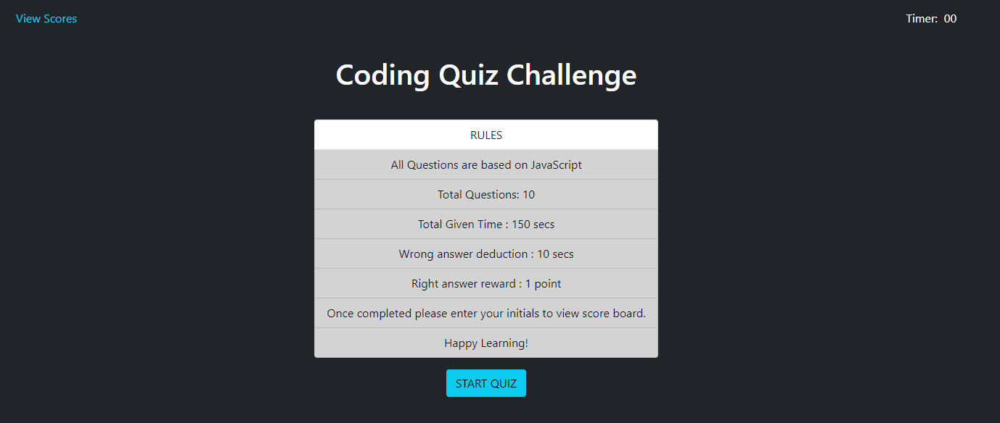
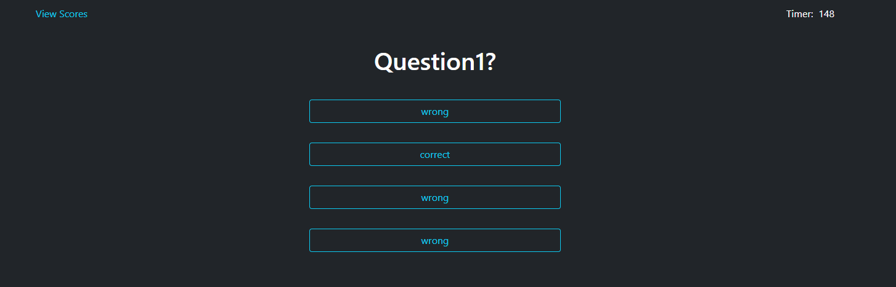
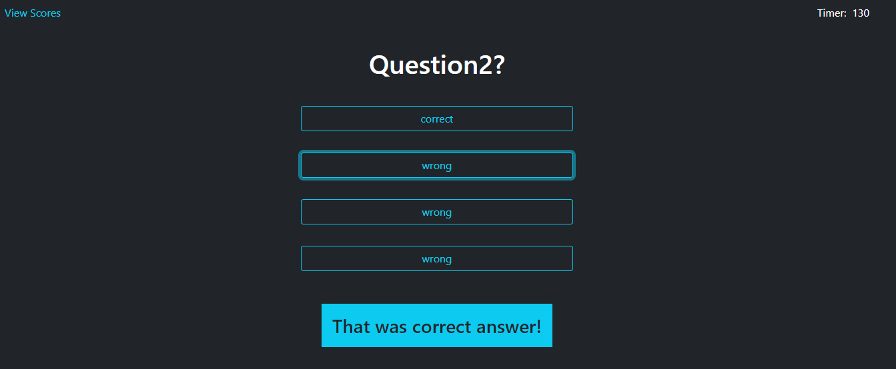
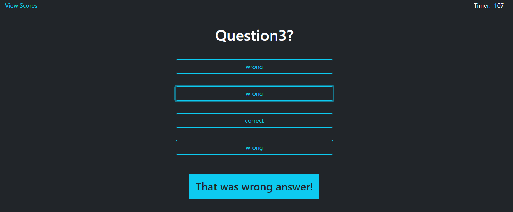
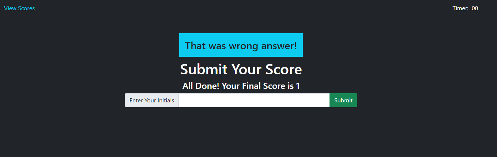
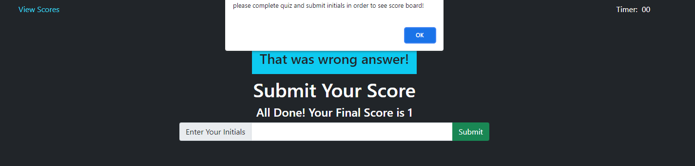
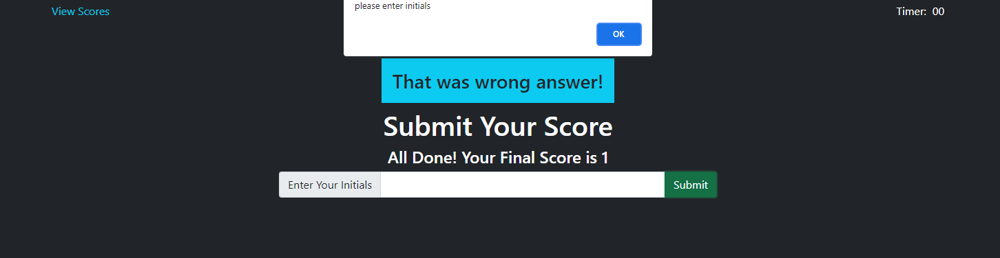
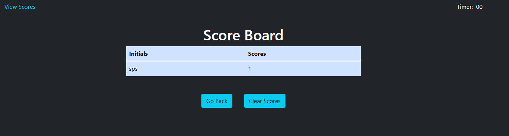

# QUIZ-APP

## Link to Application
Click on link to see the deployed website [https://sehaj97.github.io/quiz-app/](https://sehaj97.github.io/quiz-app/)

## Description
The page have code for quiz app.

The project was clean coded to handle scores and timer based on the answer given during quiz.

you can add new quiz data if you want only by changing the quizdata variable in js file but make sure to keep the format of array same

### Clone the repository
git clone git@github.com:sehaj97/quiz-app.git

_or_

git clone https://github.com/sehaj97/quiz-app.git

## Screenshots
### Screenshot when the page first loads

### Screenshot for look and feel of questions and answers when quiz is on going

### Screenshot if you answer correct

### Screenshot if you answer wrong

### Screenshot to submit score

### Screenshot of if you try to view score without submiting

### Screenshot if you submit no initials

### Screenshot of scoreboard

